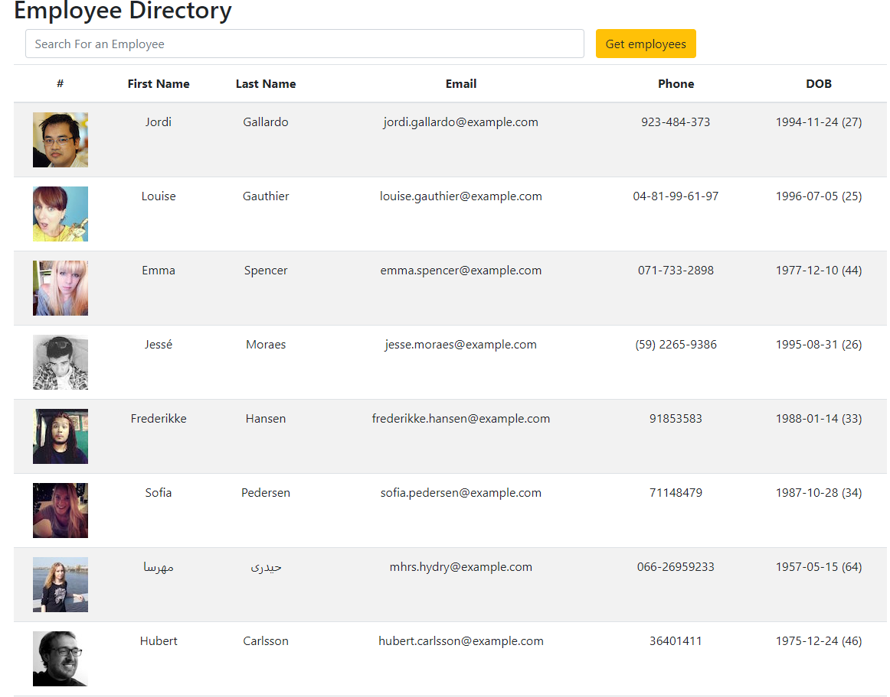
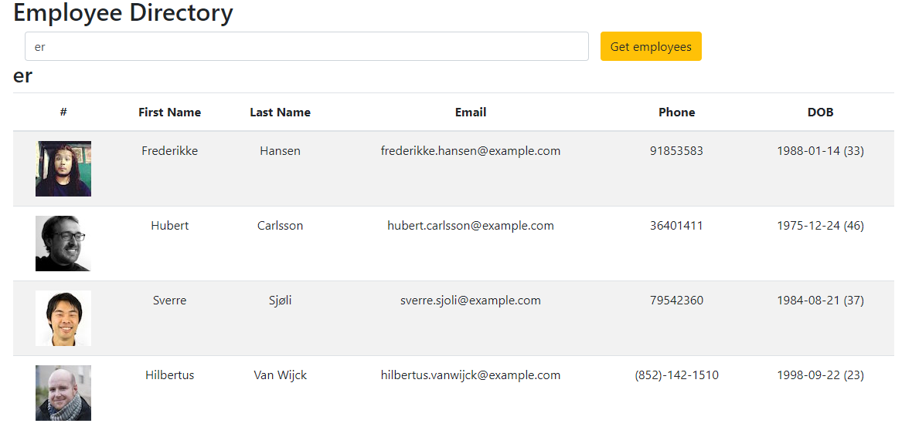

## Employee Directory

This project uses React to render a directory of randomly generated employees. It uses axios to generate the random users, and react hooks to pass information to the relevant components.

[Deployed Site](https://sammyk118.github.io/Employee-Directory/)

# Site



# With search



# React hooks
```javascript
//state variables named 'employees', 'filteredEmp', and 'employeeSearch'
  const [employees, setEmployees] = useState([]);
  const [filteredEmp, setFilter] = useState([]);
  const [employeeSearch, setSearch] = useState([]);

//runs each time the search form content changes
  const handleInputChange = event => {
    const { value } = event.target;
    setSearch(value);
    updateTable(value);
  }

//changes filteredEmp to only take employees matching the search
  const updateTable = (val) => {
    val = val.toLowerCase();
    let newArr = [];
    employees.filter(emp => {
      let empVal = emp.name.first.toLowerCase();
      if (empVal.match(val)) {
        newArr.push(emp)
      }
    })
    setFilter(newArr);
```

**Sammy Kroner**

[LinkedIn](www.linkedin.com/in/samuel-kroner-44aa11169)

[GitHub](https://github.com/sammyk118)
